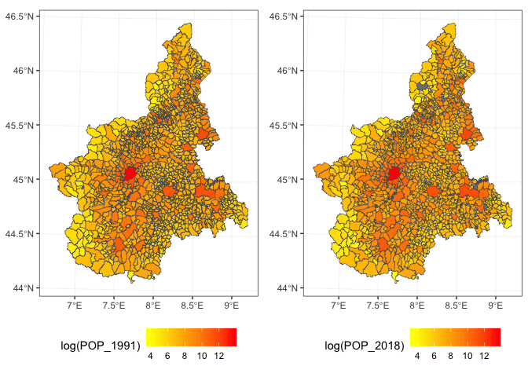
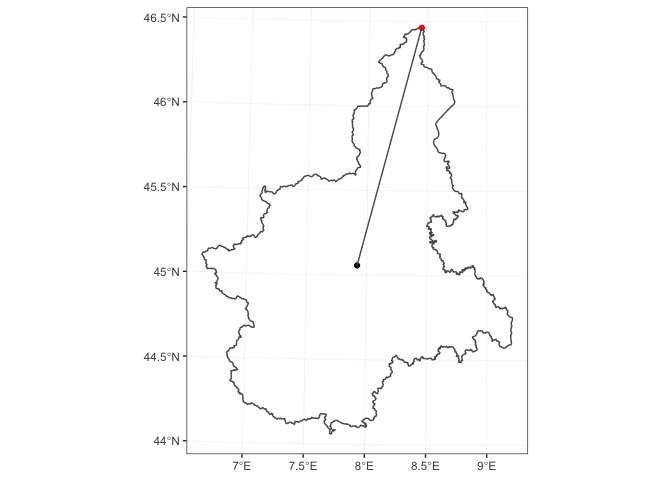
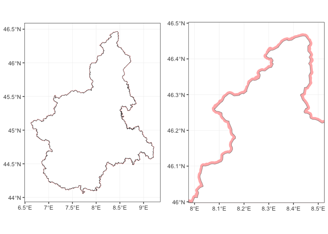
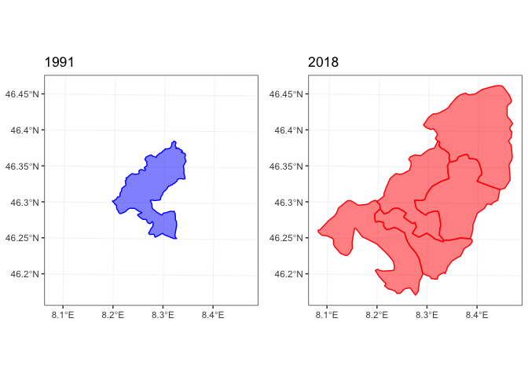
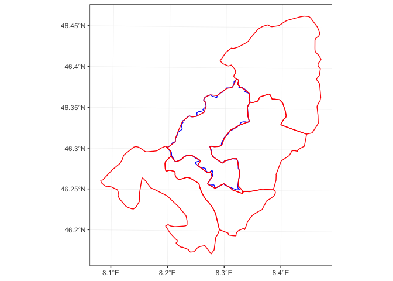
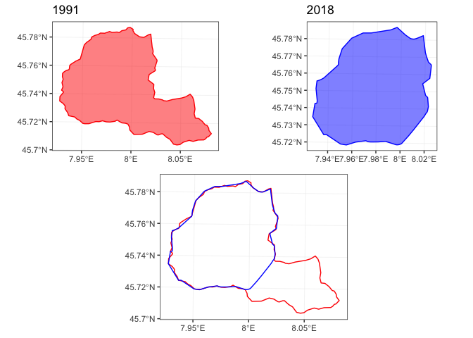
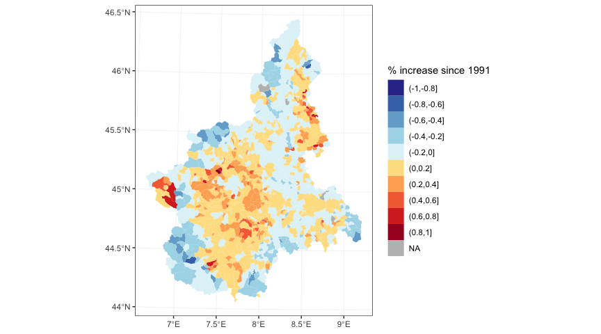

recogeo: A new R package to reconcile changing geographies boundaries
(and corresponding variables)
================
Francesco Bailo

Demographics information is usually reported in relation to precise
boundaries: administrative, electoral, statistical, etc. Comparing
demographics information reported at different point in time is often
problematic because boundaries keep changing. The **recogeo** package
faciliates reconciling boundaries and their data by a spatial analysis
of the boundaries of two different periods. In this post, I explain how
to install the package, reconcile two spatial objects and check the
results.

## Install the package

Let’s first make sure the package is installed from Github and can load
correctly. If you don’t have it already, you might to install the
devtools with `install.packages('devtools)`. Then you can install the
package with:

``` r
library(devtools) 
install_github('fraba/recogeo')
```

and load it with .

At this point the **recogeo** package should be loaded and attached. If
you get an error, make sure to create a new issue
[here](https://github.com/fraba/recogeo/issues) or to post a comment
below.

## Spatial data

Now let’s load two [*Simple
Features*](https://en.wikipedia.org/wiki/Simple_Features) (or *sf*) and
their corresponding *data.frame*. These two objects contains information
about boundaries and population of Piedmont **comune**, the lowest
administrative divisions in Italy, for 1991 and 2018. You can download
the `spatial_objs.rda` from [here](http://example.com).

``` r
load("data/spatial_objs.rda")
```

Let’s plot the two *sf* polygons, coloring each comune based on
corresponding population.

``` r
library(ggplot2)
library(gridExtra)
grid.arrange(
  ggplot(piedmont_1991.sf) +
    geom_sf(aes(fill = log(POP_1991)), lwd = 0.2) +
    scale_fill_gradient(low="yellow", high="red"),
  ggplot(piedmont_2018.sf) +
    geom_sf(aes(fill = log(POP_2018)), lwd = 0.2) +
    scale_fill_gradient(low="yellow", high="red"),
  ncol = 2)
```

<!-- -->

From 1991 to 2018, the number of *comune* in Piedmont has decreased from
1,209 to 1,197 while the total population of the region has increased
from 4,302,565 to 4,371,054. In the 2018 dataset, 4 *comune* have
missing values for `POP_2018` (grey in the plot).

We want to compare how the population has changed over time. But, as it
is common, altought the outer boundaries of the region have probably not
changed (but let’s also check this) internal boundaries have been
redrawn. In other words, to conduct a one-to-one comparison between 1991
and 2018, we need to identify a new set of geographic units
(i.e. polygons) that is related to both the 1991 and 2018 polygons
either by a **one-to-one relation**, when the unit has not changed over
time, or by a **one-to-many** relation, when the unit has changed. The
**one-to-many** relation will involve the union of multiple polygons and
the transformation of their varibales.

First, let’s see whether the external boundaries have changed. How to do
is not a trivial problem. Even if two polygons represent the same
geographic area it would be rare for the two to be *exactly* equal. From
a GIS perspective *equality* (or `sf::st_equals()`) means that the
ordered set of points defining the two spatial features is equal, so
same point coordinates but also points expressed in the same order.
Clearly if two features are the product of distinct digitalisation
processes the number, order and position of points will be different or
slighlty different. As a result the area of the polygons defined by the
external boundaries will be similar but not equal.

Let’s check it, after removing (small) gaps between polygons and
cobining all them all:

``` r
library(dplyr)
library(lwgeom)

piedmont_union_1991.sf <-
  piedmont_1991.sf %>% 
  st_snap_to_grid(size = 0.1) %>% # Remove the gaps
  st_make_valid() %>% # Make sure the resulting geometry is valid
  st_union() # Combine the polygons

area_1991 <- 
  piedmont_union_1991.sf %>%
  st_area() %>% # Compute the area in meters
  as.numeric()

piedmont_union_2018.sf <-
  piedmont_2018.sf %>% 
  st_snap_to_grid(size = 0.1) %>% # Remove the gaps
  st_make_valid() %>% # Make sure the resulting geometry is valid
  st_union() # Combine the polygons

area_2018 <- 
  piedmont_union_2018.sf %>%
  st_area() %>% # Compute the area in meters
  as.numeric()
```

`piedmont_1991.sf` returns an area of 25,388,412,731.44
while`piedmont_2018.sf` returns an area of 25,393,877,191.08. That is,
`area_2018` is 0.02% bigger than `area_1991`. That is, this approach
will not be that conclusive on whether the two polygons are actually the
same.

A better approach will be to check whether the two polygons *contain*
each other. So

``` r
st_contains(piedmont_union_1991.sf, 
            piedmont_union_2018.sf)
```

    ## Sparse geometry binary predicate list of length 1, where the predicate was `contains'
    ##  1: (empty)

``` r
st_contains(piedmont_union_2018.sf, 
            piedmont_union_1991.sf)
```

    ## Sparse geometry binary predicate list of length 1, where the predicate was `contains'
    ##  1: (empty)

The `(empty)` results means that, the two geometries don’t contain each
other. This is again not surprising since we have two complex polygons
defined by 4383 and 4667 points respectively. It only suffices that one
point is slighlty outside the other boundary to fail the
`sf::st_contains()` test. But we can overcome this problem by slighlty
expand the two geometries by a few meters (e.g. 800) with
`sf::st_buffer` and retest.

``` r
st_contains(st_buffer(piedmont_union_1991.sf, 800), 
            piedmont_union_2018.sf)
```

    ## Sparse geometry binary predicate list of length 1, where the predicate was `contains'
    ##  1: 1

``` r
st_contains(st_buffer(piedmont_union_2018.sf, 800), 
            piedmont_union_1991.sf)
```

    ## Sparse geometry binary predicate list of length 1, where the predicate was `contains'
    ##  1: 1

How much to expand the geometries will depend on the overall size. For
example, if we take the `piedmont_union_1991.sf` the maximum distance
between its centroid and its points is 161,548.78 meters so we are
expanding the geometry by about 0.5% of this measure.

``` r
max_distance_1991 <- 
  piedmont_union_1991.sf %>% 
  st_cast("POINT") %>% 
  st_distance(st_centroid(piedmont_union_1991.sf)) %>%
  max() %>% 
  as.numeric()
```

<!-- -->

And this is what the `piedmont_union_1991.sf` expanded polygon looks
like if we plot it behind the `piedmont_union_218.sf` polygon.

<!-- -->

We have now a fair assumption that based on our spatial analysis the the
outer boundary of the region isn’t changed and what is changed are only
internal administrative boundaries.

## Relation between geographies

To reconcile the internal geographies, we use the core function from the
**recogeo** package: `reconcileGeographies()`. What the function
requires are two spatial objects with a unique id variable (if we don’t
specify the column names of the unique id, the first column of each
*data.frame* will be assumed to be the unique id variable). We can also
add a preferred CRS with units in meters expressed using the [EPSG
code](https://www.epsg-registry.org/) (this [link](http://epsg.io/) is
also usefull to find a coodinate system). Two additional numeric
parameters can also be specified: the distance or width in meters of the
buffer (`dist_buffer`) and the minimum intersection area in squared
meters (`min_inters_area`).

We already explained before why it might be necessary to expand the
geometries to test for equality. In the code before we set the
`dist_buffer` to 800 meters but by default the the function will expand
them by 5 meters. It is important to try different values if you obtain
unsatisfactory results.

The `min_inters_area` arguemnt allows you to set the tollerance for the
intersection test between two geometries. This might be necessary
because of very small differences in the boundaries contained in the two
spatial objects. For example, let’s find out which features from
`piedmont_1991.sf` intersects with `piedmont_1991.sf`.

``` r
res <- 
  st_intersects(piedmont_1991.sf, piedmont_2018.sf)
```

`res` is now a sparse matrix (actually a list) of with dimensions 1209,
1197, which of course corresponds to the features of the first and
second spatial object respectively. The first features of the first
spatial objects intersects with the following features from the second
object:

``` r
res[[1]]
```

    ## [1] 1127 1147 1152 1177 1191

Let’s plot
everything.

<!-- --><!-- -->

This intersections seems mostly due to changes in the precision of the
geometries from the two datasets. The boundary of `piedmont_1991.sf[1,]`
has 196 points while the boundary of the corresponding
`piedmont_2018.sf[1127,]` has 265 points.

This specific setting (which is actually very common) raises two
questions. 1. Should we consider consider `piedmont_1991.sf[1,]` and
`piedmont_2018.sf[1127,]` as the same geography? 2. Should we consider
the intersection between `piedmont_1991.sf[1,]` and the other four
geographies (1147, 1152, 1177, 1191) as significant enough to suggest to
combine all the geographies involved?

Let’s see how the `reconcileGeographies()` will answer to both
questions, giveng the default arguments of `dist_buffer = 800` and
`min_inters_area = 350000`.

The answer to the first question is determined by

``` r
dist_buffer <- 800

res1 <-
  sf::st_contains(piedmont_1991.sf[1,] %>%
                    sf::st_buffer(dist_buffer),
                  piedmont_2018.sf[1127,],
                  sparse = FALSE)
res2 <- 
  sf::st_contains(piedmont_2018.sf[1127,] %>%
                    sf::st_buffer(dist_buffer),
                  piedmont_1991.sf[1,],
                  sparse = FALSE)

res1 == TRUE & res2 == TRUE
```

    ##      [,1]
    ## [1,] TRUE

And the answer to the second question is determined by

``` r
min_inters_area <- 350000

intersection_area <-
  st_area(
    st_intersection(st_geometry(piedmont_1991.sf[1,]),
                    st_geometry(piedmont_2018.sf[res[[1]][2:5],]))
  )

as.numeric(intersection_area) > min_inters_area
```

    ## [1] FALSE FALSE FALSE FALSE

What the user will need to decide is the tollerance for both the
equality and intersection tests. In order to determine the best value it
is important to visually inspect the results and probably also to
determine the precision of the boundaries (in terms of the number of
points used to describe the features) of the two spatial objects. And a
rough estimation of the respective precisions can be obtained by
`object.size(piedmont_1991.sf)` (2534.9 Kb) and
`object.size(piedmont_2018.sf)` (2603.7 Kb).

## reconcileGeographies()

After determinging the what kind of tollerance should we pass to the
function, it is now time to actually run the function on the two spatial
objects.

``` r
library(recogeo)
res <-
  recogeo::reconcileGeographies(piedmont_1991.sf, piedmont_2018.sf,
                                dist_buffer = dist_buffer,
                                min_inters_area = min_inters_area)
```

The results from the function is a *data.frame* where each row describes
a relationship between a pair of geographies from the two datasets.

| unigeokey\_A | unigeokey\_B | type         |
| :----------- | :----------- | :----------- |
| 003086       | 103039       | same         |
| 003079       | 003079       | same         |
| 006150       | 006150       | same         |
| 001020       | 001020       | AintersectsB |
| 001118       | 001118       | same         |
| 006010       | 006010       | same         |
| 002159       | 096076       | same         |
| 001051       | 001051       | same         |
| 004012       | 004012       | AintersectsB |
| 003053       | 103023       | same         |

The **recogeo** package contains two functions to check the result from
`reconcileGeographies()`. The first function,
`reportReconciledGeographies()`, produces a report to visually inspect
every relationship. So for example, the relationship
“`piedmont_1991.sf[piedmont_1991.sf$PRO_COM_T == '002110',]` contains
`piedmont_2018.sf[piedmont_2018.sf$PRO_COM_T == '002110',]`” will be
reported like this

<!-- -->

In this case, it seams clear that the 1991 *comune* lost part of its
territory to another *comune* or resulting in a new *comune* being
created.

The function `testReconciledGeographies()` instead tests the spatial
characteristics of reconciled geographies. It takes the *data.frame*
resulting from the `reconcileGeographies()` function and the spatial
objects.

``` r
test_res <-
  recogeo::testReconciledGeographies(res, 
                                     piedmont_1991.sf, piedmont_2018.sf)
```

This tests is particularly important to determine whether the results
are satisfactory because compare the sum of the areas of the old
geographies from the two spatial objects that correspond to new
reconciled
geographies.

``` r
kable(test_res[sample(1:nrow(test_res), 10),], row.names = F)
```

| .unigeokey\_new | n\_A |  area\_A | n\_B |  area\_B | area\_diff\_perc |
| --------------: | ---: | -------: | ---: | -------: | ---------------: |
|             159 |    1 |  7094782 |    1 |  7072210 |           0.3181 |
|             619 |    1 | 52620874 |    1 | 52043281 |           1.0977 |
|             919 |    1 | 11520025 |    1 | 11714918 |         \-1.6918 |
|             503 |    1 | 16400136 |    1 | 17077313 |         \-4.1291 |
|            1080 |    1 | 53602589 |    1 | 52839931 |           1.4228 |
|             511 |    1 | 43188795 |    1 | 43481647 |         \-0.6781 |
|             888 |    1 | 23707751 |    1 | 23754394 |         \-0.1967 |
|             659 |    1 | 35419737 |    1 | 35385019 |           0.0980 |
|             108 |    1 | 93450715 |    1 | 92209899 |           1.3278 |
|             203 |    1 |  8431837 |    1 |  8729941 |         \-3.5355 |

The column `n_A` and `n_B` indicates how many geographies need to be
aggregated to create a new reconciled geography. The `area_diff_perc`
column indicates the percentage difference between the two new
reconciled geographies resulting from the union of the geographies from
the two original spatial objects. Intuitively, a new reconciled
geographied can be produced by the union of geographies from any of the
two original spatial objects.

## reconcileData()

The final step is to produce a new dataset, optionally containing also
geographic information of a new set of reconciled geographies, with
variables transformed when necessary to allow a comparison between data
from the two original datasets.

``` r
reconciled_data.sf <-
  recogeo::reconcileData(res, 
                         piedmont_1991.sf, piedmont_2018.sf, 
                         varA = 'POP_1991', varB = 'POP_2018',
                         return_spatial = "B")
```

The arguments `varB` and `varB` indicate the variable we want to
reconcile for comparison (they will be summed in case geographies are
aggregated) while the argument `return_spatial` indicates whether we
want the reconciled spatial features to be based on the first or second
original spatial objects.

After we have reconciled geographies and variables, it is now time to
understand how the population has changed over time at the finest level
possible given the original information.

<!-- -->
